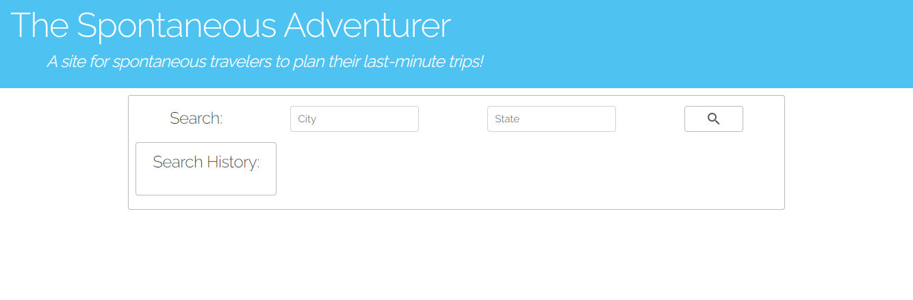
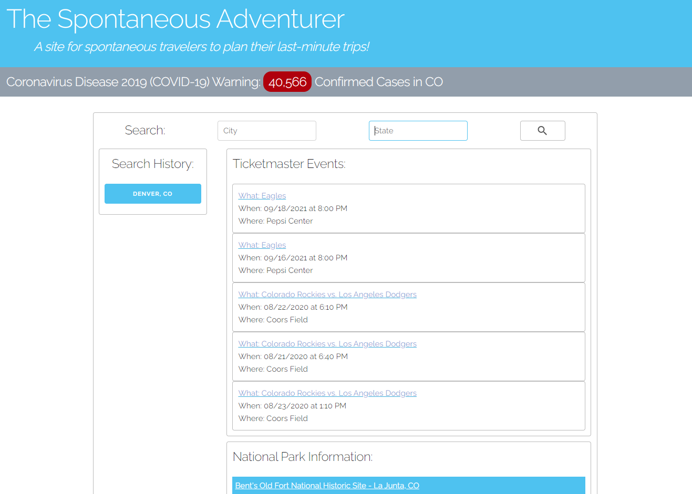
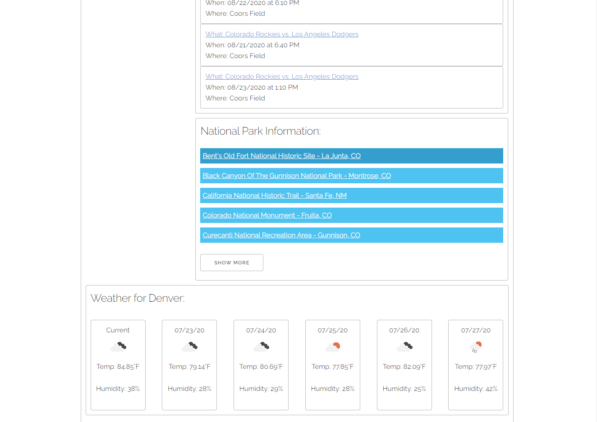
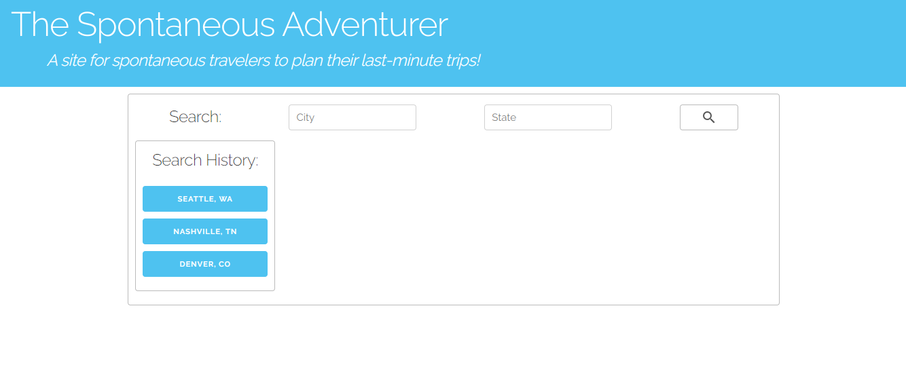
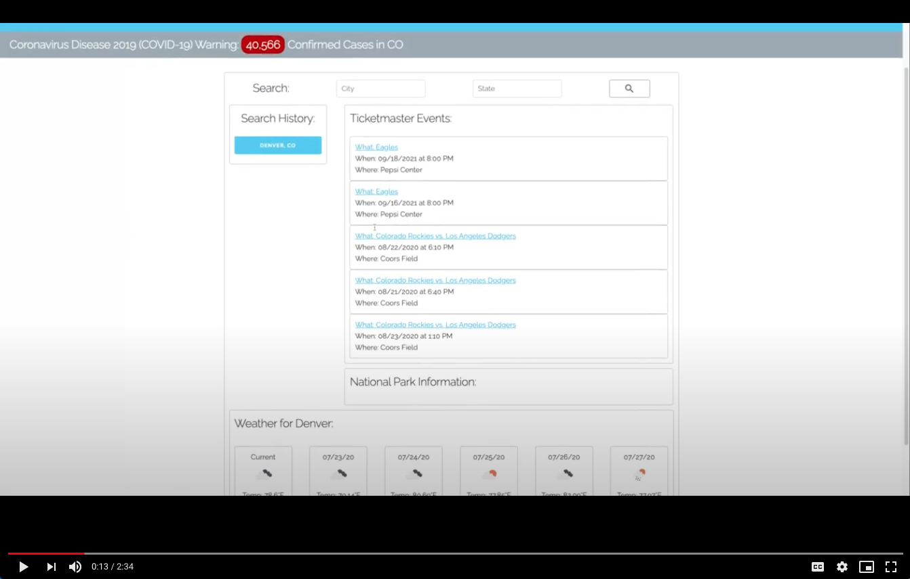

# The Spontaneous Adventurer
* The must have guide for your last minute excursions.

## Table of contents
* [Concept](#concept)
* [Process](#process)
* [Demo](#demo)
* [Future Development](#future-development)
* [Link](#link)
* [Contribution](#contribution)

## Concept

### User Story
AS A person living through the Covid-19 pandemic

I WANT to get out of the house.

HOWEVER, current conditions prevent me from planning my travel too far in advance.

I NEED a way to plan for last-minute trips.

The Spontaneous Adventurer serves as a guide for last-minute getaways and day trips, providing current information on events, nearby parks, weather conditions and current COVID-19 conditions in a given location. 

In this time of uncertainty, a last-minute getaway can reduce anxiety that comes from staying home. The Spontaneous Adventurer provides the information needed to plan a successful adventure at a traveler's fingertips.

## Process
The project was built with HTML, CSS, JavaScript, and JQuery. The project also utilized Moment.js, Skeleton CSS, and Google Fonts.

The following APIs were used:
* COVID Tracking
* National Parks Service
* TicketMaster
* Open Weather

Each team member was assigned an element of the application. 

* Taylor handled the HTML layout, the CSS framework, and created the COVID and current weather functions.
* Tracey created the National Parks function, weather forecast function and error display.
* Sharee created the Ticketmaster function and README file.
* Rachel created the functions for local storage and persistent data.

While each team member had their own role, the project was truly a group effort with several study sessions to work through challenges together.

### Challenges:
* Learning to use GitHub as a team to push and merge different branches
* Finding a method for creating a function to prevent the search history from duplicating

### Successes: 
* Learning to use GitHub as a team.
* Communicating and working as a team.

## Demo

## Future Development
* Expand from just the US to worldwide
* Expanded API information from more sources
  * Hotel info
  * Flight/rental car info
  * Food and dining info
* Geolocation feature to find user's location
* Future dates feature to allow user to search a specific date range in the future
* More error handling and reporting for invalid searches

## Known Issues
* UPDATE: Fixed - Ticketmaster API doesn't return events in chronological order
* UPDATE: Fixed - Ticketmaster API doesn't list a time for an all day event
* National Parks API server is very slow (~6 seconds)
* Application's error handling only accounts for empty city/state search fields and state searches longer than two characters.  Needs more error handling for 400 errors, 404 errors and the like.
* Cross-site cookie handling

## Links
https://taylornyquist.github.io/spontaneous-adventurer/

https://github.com/taylornyquist/spontaneous-adventurer

## Contribution
* Taylor Nyquist (https://github.com/taylornyquist)
* Tracey Jackson (https://github.com/cjacktwil)
* Rachel Fritz (https://github.com/rachelf0)
* Sharee Burkeen (https://github.com/sharee-k)
